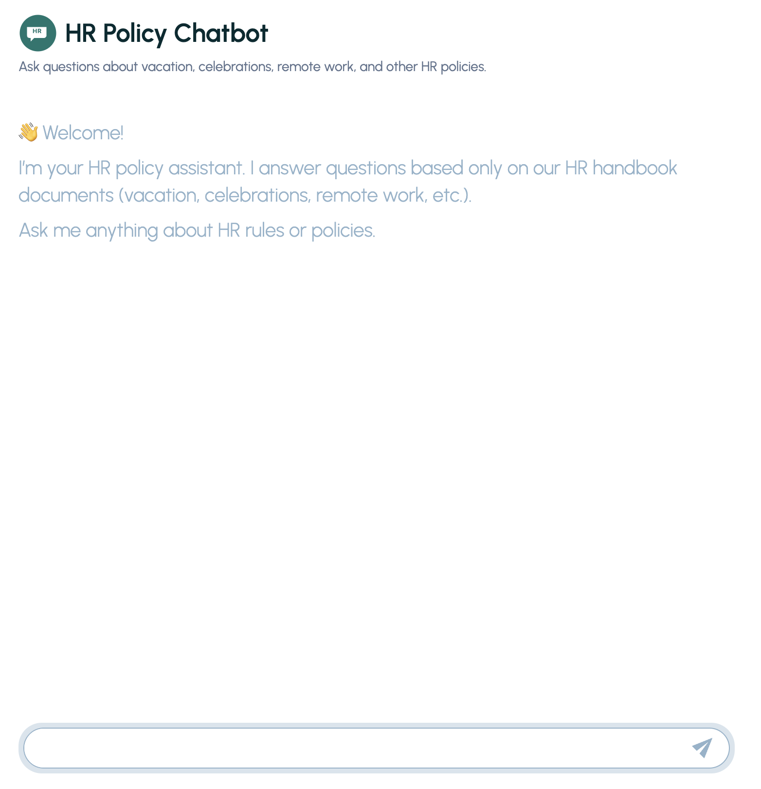
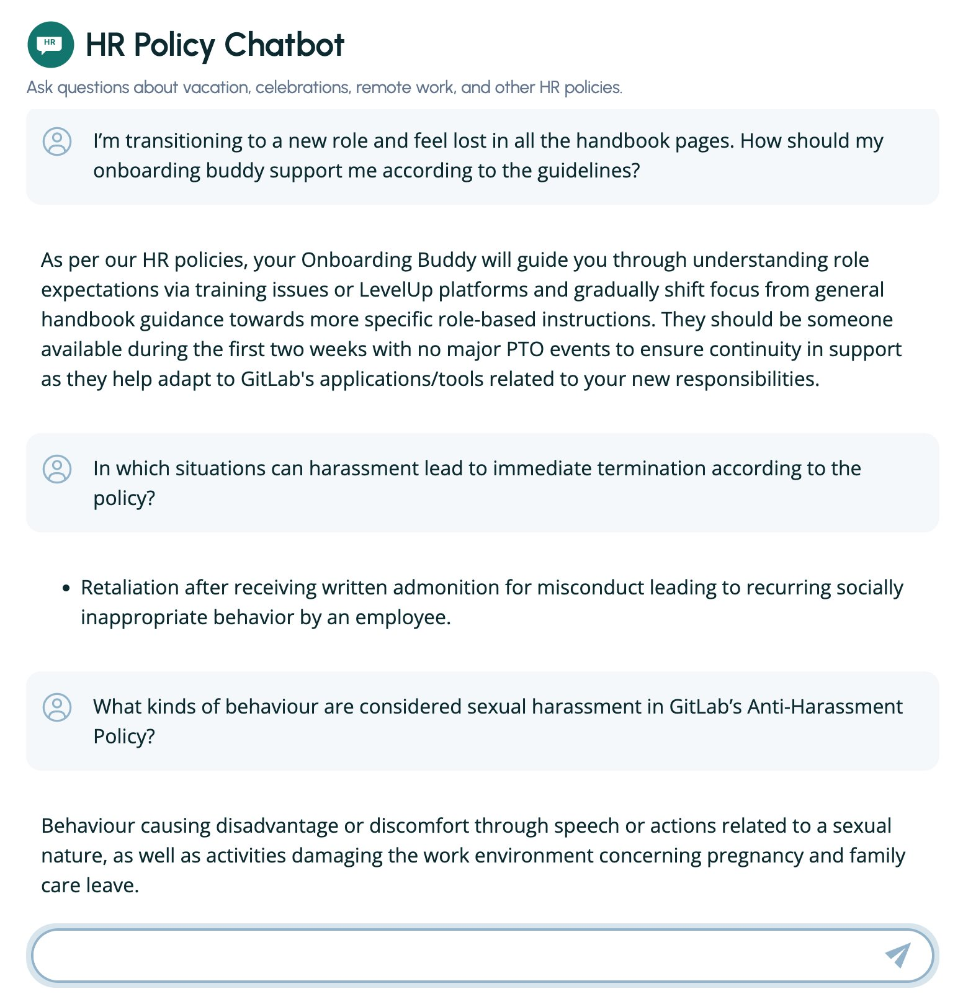
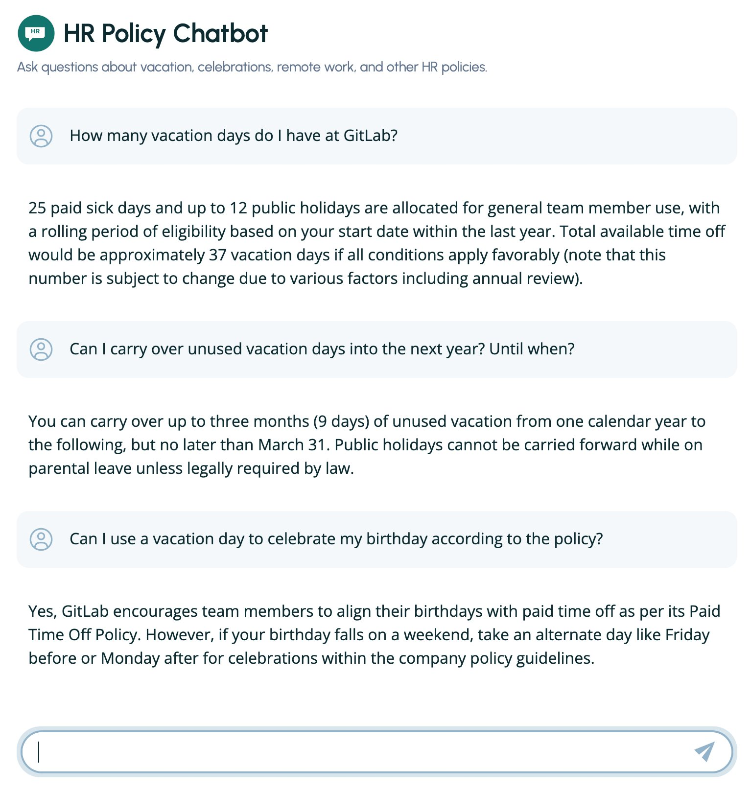

# HR Policy Chatbot

This project implements a Retrieval-Augmented Generation (RAG) chatbot that answers questions about HR policies such as vacation rules, celebrations, remote work, and other handbook topics.

## System Architecture

The system consists of:

- **FastAPI backend** – REST API for chat interactions
- **ChromaDB vector store** – persistent document retrieval and embedding storage
- **Local language model (Ollama)** – phi3:mini by default for answer generation
- **React/Vite frontend** – modern, responsive chat interface

All HR policy source documents are stored as Markdown files under `data/hr_policies/`.

## Features

### Markdown Ingestion
- Script `src/ingest_md.py` scans all `.md` files under `data/hr_policies/` (including subfolders)
- Files are split into semantic chunks
- Each chunk is embedded with `sentence-transformers/all-MiniLM-L6-v2`
- Embeddings and metadata (source path + chunk index) are stored in a persistent ChromaDB collection named `hr-policies`

### Vector Retrieval
- At query time, the backend converts an incoming question into an embedding
- The most similar chunks are retrieved from the ChromaDB collection
- Retrieved chunks are used as context for answer generation

### Local Answer Generation (Ollama)
- Context and question are combined into a prompt
- A local LLM served by Ollama (phi3:mini by default) generates the answer
- The prompt instructs the model to answer only from the provided context and return a fallback message if information is not present

### Streaming Endpoint
- Besides a standard `/chat` endpoint, the backend provides `/chat-stream`
- Streams the answer token-by-token as plain text
- The Vite frontend consumes this stream and progressively updates the last assistant message, improving perceived latency

### Modern Frontend
- The `frontend_vite/` application uses React + Vite + TailwindCSS
- The UI consists of a header, main chat area, and autosizing input field
- Messages are rendered with Markdown, loading states and errors are visualized
- The view auto-scrolls while streaming

## Screenshots

### Chat Interface

**Welcome Screen**



*The initial welcome screen with the introductory message about HR policy assistance.*

**Chat Interactions**





*Examples of chat interactions showing user queries and streamed responses from the chatbot.*

## Project Structure

```
hr_rag_chatbot_new/
├── config.py                      # optional global configuration (paths, model names)
├── data/
│   ├── hr_policies/               # HR policy Markdown files (subfolders allowed)
│   └── chroma/                    # persistent ChromaDB index (created by ingest_md.py)
├── frontend_vite/                 # Vite/React frontend
│   ├── src/
│   │   ├── api.js                 # wrapper around backend API (/chat and /chat-stream)
│   │   ├── App.jsx                # main layout (header + Chatbot)
│   │   ├── components/            # Chatbot, ChatInput, ChatMessages, Spinner
│   │   ├── hooks/                 # custom hooks (autosize textarea, auto-scroll, etc.)
│   │   └── index.css              # Tailwind and base styles
│   └── …                          # Vite config, assets, package.json, etc.
├── hr_docs/                       # optional scratch directory (not required)
├── requirements.txt               # Python backend dependencies
└── src/
    ├── api_server.py              # FastAPI app exposing /chat and /chat-stream
    ├── ingest_md.py               # ingestion script for HR Markdown policies
    ├── rag_backend.py             # earlier CLI retrieval script (debugging)
    ├── rag_chat_ollama.py         # earlier terminal chat with Ollama + RAG
    └── chatbot.py                 # simple local Ollama chat (no RAG)
```

## Prerequisites

The following components are required:

- **Python 3.11** – Backend components rely on packages that currently support Python 3.11 (for example onnxruntime via ChromaDB)
- **Node.js ≥ 16 and npm** – Required for building and running the React/Vite frontend
- **Ollama** – Local LLM runtime used for answer generation
  - On macOS with Homebrew:
    \`\`\`bash
    brew install ollama
    ollama pull phi3:mini
    \`\`\`
  - Any other Ollama model can be used; the model name just needs to be updated in \`src/api_server.py\`

## Backend Setup

### 1. Create and activate virtual environment

From the project root \`hr_rag_chatbot_new/\`:

\`\`\`bash
python3.11 -m venv .venv
source .venv/bin/activate
\`\`\`

After activation, \`python --version\` should report a 3.11.x release.

### 2. Install Python dependencies

With the virtual environment active:

\`\`\`bash
pip install --upgrade pip
pip install -r requirements.txt
\`\`\`

This installs FastAPI, Uvicorn, ChromaDB, sentence-transformers, and the Ollama client, among others.

## Populate the Knowledge Base

### 3. Place HR policy documents

Store the HR Markdown files under \`data/hr_policies/\`. Subdirectories are supported:

\`\`\`
data/hr_policies/
├── vacation/
│   └── gitlab_vacation_policy.md
├── celebrations/
│   └── celebrations.md
└── other-topics/
    └── …
\`\`\`

### 4. Run the ingestion script

With the virtual environment active:

\`\`\`bash
python src/ingest_md.py
\`\`\`

The script:
- Scans all \`.md\` files under \`data/hr_policies/\`
- Splits content into chunks
- Computes embeddings with \`all-MiniLM-L6-v2\`
- Upserts the chunks and metadata into the ChromaDB collection \`hr-policies\` under \`data/chroma/\`

The script logs the number of documents and chunks processed and confirms when ingestion has completed successfully.

## Run the Backend API

### 5. Ensure Ollama and the model are running

Typical sequence:

- Start the Ollama service if necessary: \`ollama serve\`
- Ensure the model is available: \`ollama pull phi3:mini\`

### 6. Start the FastAPI server

With the virtual environment active:

\`\`\`bash
uvicorn src.api_server:app --reload --port 8000
\`\`\`

The server listens on \`http://127.0.0.1:8000\` and exposes:

#### POST /chat
- **Request body:** JSON object with a \`question\` field
- **Example:** \`{ "question": "How many vacation days do I have at GitLab?" }\`
- **Response body:** JSON object containing:
  - \`answer\`: generated answer text
  - \`sources\`: list of \`{ "source": <path>, "chunk_index": <int> }\` used for the answer

#### POST /chat-stream
- Same request body as \`/chat\`
- Returns a streaming response (Server-Sent Events style, plain text chunks)
- Represents the answer as it is generated
- Intended for use by the frontend to display incremental updates

A quick manual test from the terminal:

\`\`\`bash
curl -X POST "http://127.0.0.1:8000/chat" \\
  -H "Content-Type: application/json" \\
  -d '{"question": "How many vacation days do I have at GitLab?"}'
\`\`\`

If ingestion and Ollama are configured correctly, the response contains the correct number of vacation days and corresponding sources.

## Frontend Setup (Vite + React)

The Vite frontend resides in \`frontend_vite/\`.

### 7. Install Node dependencies

From \`frontend_vite/\`:

\`\`\`bash
npm install
\`\`\`

### 8. Configure backend URL

Create a \`.env.local\` file in \`frontend_vite/\` with the backend base URL:

\`\`\`
VITE_API_URL=http://127.0.0.1:8000
\`\`\`

The frontend reads this environment variable in \`src/api.js\` to know where to send chat requests.

### 9. Start the frontend development server

From \`frontend_vite/\`:

\`\`\`bash
npm run dev
\`\`\`

By default Vite serves the app at \`http://localhost:3000\`.
The page displays the header plus the chat interface.

## Frontend Chat Behaviour

The main chat logic is implemented in \`frontend_vite/src/components/Chatbot.jsx\`, together with helper components \`ChatMessages.jsx\` and \`ChatInput.jsx\`.

Typical flow:

1. **When the application loads** and no messages exist yet, an introductory block is displayed:
   - 👋 Welcome!
   - Explanation that the assistant answers questions purely based on HR handbook documents (vacation, celebrations, remote work, etc.)

2. **After a question is entered** in the input field and submitted:
   - A user message is appended to the internal state
   - An empty assistant message with \`loading: true\` is added

3. **The Chatbot component uses api.js** to communicate with the backend:
   - \`api.createChat()\` can initialise a chat session if required by the API design
   - \`api.sendChatMessage(chatId, message)\` sends the question and receives a text stream from \`/chat-stream\`

4. **The parseSSEStream helper** (in \`src/utils.js\`) iterates over the server-sent text chunks:
   - For each chunk, the assistant's last message is updated by appending the new text

5. **When streaming completes**, the assistant message is marked as \`loading: false\`
   - Errors during the process mark the message with \`error: true\` and show an error line
   - Existing content is kept if any

## Customisation (Current Scope)

- **Introductory text** can be adapted in \`frontend_vite/src/components/Chatbot.jsx\` by editing the JSX block rendered when \`messages.length === 0\`
- **System prompt and LLM behaviour** can be tuned in \`src/api_server.py\` inside the functions that build the context and call \`ollama.chat\`
  - For example, the strictness regarding "answer only from context" or the tone of the answer can be adjusted here
- **Embedding model** can be changed by modifying the \`EMBEDDING_MODEL_NAME\` constant in \`src/api_server.py\`
  - Any model supported by sentence-transformers and compatible with the current hardware can be used

## Example Questions

After backend and frontend are running and the GitLab HR policies are ingested, typical interactions include:

- **"How many vacation days do I have at GitLab?"**
  - Answer: number of days per year as specified in the vacation policy

- **"Can unused vacation days be carried over to the next year?"**
  - Answer: explanation of carry-over rules and relevant deadline (for example 31 March)

- **"What happens if my birthday falls on a weekend?"**
  - Answer: description of taking an alternative day off according to the celebrations policy

- **"Is there a policy about celebrations or significant life events?"**
  - Answer: overview of relevant sections in the celebrations or people-related policies

For unrelated questions such as **"Recommend the best burger place in New York"** the assistant responds with a variant of:

> "I cannot answer that based on the available HR policies."

## MVP Scope

For the current semester project, the minimal viable product (MVP) includes:

- Ingestion of HR policies from Markdown files into a vector store
- Retrieval of relevant policy chunks for a given question
- Generation of answers using a local Ollama model, constrained to the retrieved context
- Exposure of \`/chat\` and \`/chat-stream\` HTTP endpoints via FastAPI
- A working React/Vite frontend that:
  - Sends questions to the backend
  - Streams and displays answers
  - Shows a clear introductory message and basic error states

This MVP demonstrates an end-to-end RAG pipeline over HR policies with a locally hosted LLM and a modern web interface.

## License

The project is released under the MIT License.
Details are provided in the LICENSE file.
